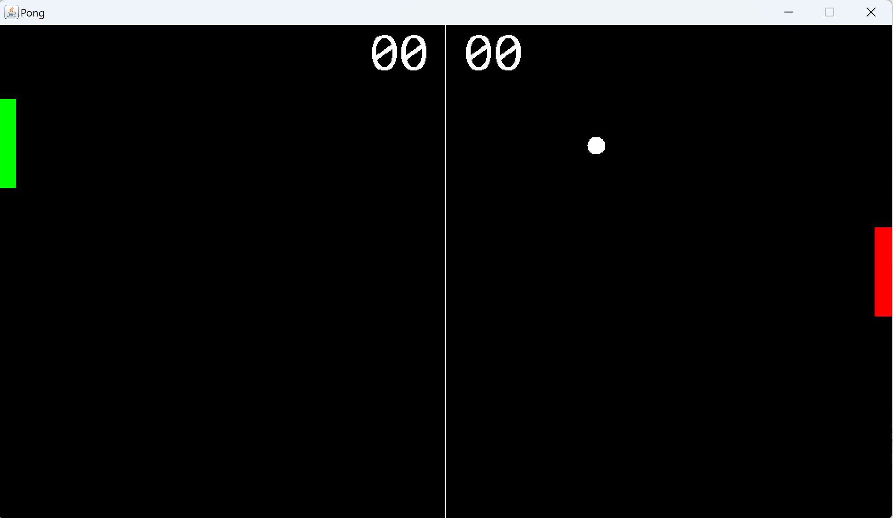

# PongGame
Recreating Pong game using Java Swing and AWT. This code was created following Bro Code's [tutorial](https://www.youtube.com/watch?v=oLirZqJFKPE) on youtube and expanded on by adding a player vs computer mode. Game as 2 modes: Player vs Computer (Control paddle with up/down arrow keys) 
player vs player (player1 controls with w/s keys and player 2 controls with up/down arrow keys).

## Built Using
* Eclipse

## Image

